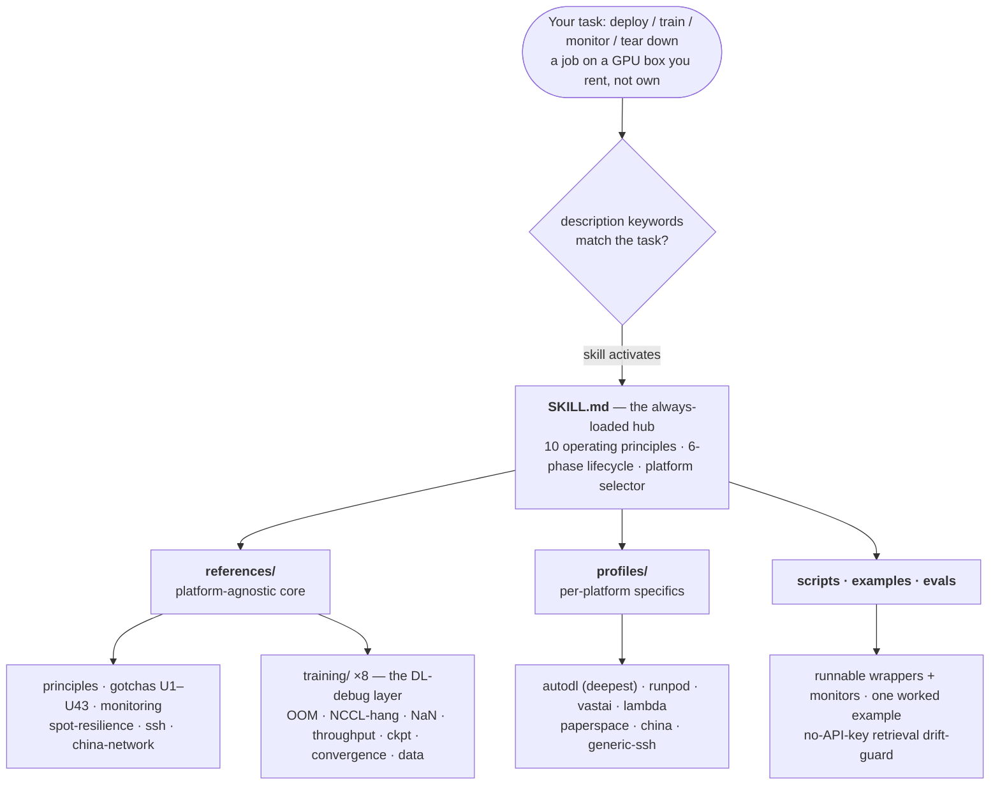
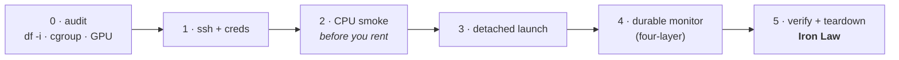

# remote-gpu-trainer

An Agent Skill for running long GPU jobs on machines you rent instead of own. It covers deploying,
training, monitoring, and tearing a job down on [AutoDL](https://www.autodl.com), RunPod, vast.ai,
Lambda, Paperspace, the Chinese platforms (恒源云 / 矩池云 / Featurize / 揽睿星舟), bare SSH boxes,
Slurm, and Kubernetes, for one instance or a fan-out of many.

[](LICENSE)
[](https://agentskills.io)
[](https://agentskills.io/specification)
[](#whats-inside)
[](#verification-status)

> **What this is, and what it isn't.** "AutoDL" here means the [autodl.com](https://www.autodl.com)
> GPU-rental platform, not AutoML or NAS. And this is an Agent Skill, meaning a `SKILL.md` with reference
> docs and script templates, not a CLI or an SDK. It sits on top of each platform's API and captures the
> operational knowledge those APIs leave out.

The skill rests on one idea: when you rent a GPU, you are a short-term tenant on someone else's machine.
Everything follows from that. Detach the job so it survives a dropped connection, get the results off the
box before it goes away, and stop the meter without losing data. That part is the same on every backend.
The things that genuinely vary between platforms (stop-vs-destroy billing, machine-locked volumes,
whether `/root` survives a power-off, acceleration proxy vs HF mirror, spot grace windows) are pushed
down into one profile per platform.



## Contents

[Why this exists](#why-this-exists) · [How it differs](#how-it-differs) ·
[Architecture and layout](#architecture-and-layout) · [Install and deploy](#install-and-deploy) ·
[What's inside](#whats-inside) · [Scope](#scope) · [Verification status](#verification-status) ·
[Disclaimer](#disclaimer) · [中文简介](#中文简介) · [Contributing](#contributing) ·
[License](#license) · [Citing](#citing)

## Why this exists

Renting the GPU is the easy part. The costly surprises are everything around the job. A box you
"stopped" that keeps billing. A checkpoint that printed `synced` but never actually wrote, because the
disk ran out of inodes rather than space. A download that hangs behind the wrong mirror. A `terminate`
that takes the only copy of a week's training with it. None of this is in the platform's API docs, and
you usually learn it after you have already paid.

This skill puts that knowledge somewhere an agent can use it: ten operating principles that say why each
step matters, a six-phase lifecycle where every phase ends in a check you can run, and one profile per
platform with the exact commands. It spends its attention on the things that cost money or data.

## How it differs

The general orchestrators (SkyPilot, dstack, Modal) own or abstract the infrastructure and price-shop
across Western clouds. They are good at that, and this skill does not compete with them. They also do not
support AutoDL or the Chinese platforms, and each one brings its own daemon or cluster model.

This skill works on the raw rented instance you already have. It concentrates on the part those tools
skip: the Chinese platforms and cheap bare-SSH rentals, where the day-to-day work is disk budgeting,
inode caps, mirror stalls, cgroup OOM, spot grace windows, and teardown you cannot take back. The two
approaches go together. Let SkyPilot or dstack move the box for you, then use this skill to make your
code resume correctly so that recovery actually continues the run instead of restarting it.

## Architecture and layout

The layout uses the Agent Skills idea of progressive disclosure: a small hub that is always loaded, with
the deeper material read in only when a phase needs it. What keeps it portable is the split between a
platform-agnostic core and platform-specific edges. The principles and the lifecycle hold everywhere.
Every concrete path, proxy, billing verb, and spot rule lives in exactly one place, the profile.

The six-phase lifecycle is the operational spine. Each phase delegates its platform details to the
active profile and ends in a check you can run:



The folders map straight onto that:

```text
remote-gpu-trainer/
├── SKILL.md                     # the hub: 10 principles + 6-phase lifecycle + platform selector
├── references/                  # platform-agnostic knowledge, loaded on demand
│   ├── principles.md            #   the 10 invariants, expanded with cross-platform nuance
│   ├── lifecycle_checklist.md   #   the 6 phases as a per-platform checklist
│   ├── gotchas_universal.md     #   U1–U43, symptom → root cause → fix (U36–U39 are cross-links)
│   ├── monitoring_patterns.md   #   four-layer durable monitoring + cross-host portability map
│   ├── spot-resilience.md       #   preemption signals, Young/Daly cadence, atomic-write resume
│   ├── ssh_transport.md         #   ssh config, resumable rsync/scp, secrets via stdin, CRLF
│   ├── china-network.md         #   mirrors, HF_ENDPOINT, the no_proxy trap
│   ├── parallel_ablation.md     #   FS-shared fan-out + the reconciliation step
│   ├── multinode.md             #   NCCL / fabric-manager / elastic training (advanced)
│   ├── self-improvement.md      #   how the skill captures new gotchas without corrupting itself
│   └── training/                #   the DL-training debug layer — when the run breaks, not the box
│       ├── oom-memory.md            #   CUDA/host OOM + the fit-it ladder
│       ├── distributed-launch.md    #   torchrun/accelerate/deepspeed + the multi-GPU HANGS toolkit
│       ├── precision-stability.md   #   fp16/bf16/tf32, NaN/Inf hunting, LLM loss spikes
│       ├── throughput-profiling.md  #   GPU-bound vs data-bound vs comms-bound
│       ├── checkpoint-resume.md     #   full-state + sharded save/resume, the resume bugs
│       ├── by-domain.md             #   LLM / vision / diffusion / RL / multimodal gotchas
│       ├── convergence-debugging.md #   runs but won't learn: optimizer/LR/loss-fn/freezing
│       └── data-pipeline.md         #   dataloader & dataset correctness (not speed)
├── profiles/                    # one file per platform — the only place concrete specifics live
│   ├── _schema.md               #   the shared 8-field contract every profile fills
│   ├── autodl.md                #   deepest, battle-tested
│   ├── runpod.md  vastai.md  lambda.md  paperspace.md
│   ├── china.md                 #   恒源云 / 矩池云 / Featurize / 揽睿星舟
│   └── generic-ssh.md           #   bare SSH / Slurm / K8s / Colab-Kaggle
├── scripts/                     # parameterized, runnable templates
│   ├── run_one.sh.template  run_queue.sh.template  health_patrol.sh.template
│   ├── mem_monitor.sh  gpu_health.sh  reap_vram_zombies.sh
│   ├── aggregate_to_fs.sh  download_loop.sh  setup-china-mirrors.sh
│   └── verify_local.py          #   load-and-verify each artifact before any teardown
├── examples/autodl_sweep/       # one complete worked case, end to end
└── evals/                       # cases.jsonl + run_evals.py (no-API-key drift guard) + RESULTS.md
```

Each profile fills the same eight fields, so a platform you have never used reads like one you have:
launch, storage survival-matrix, network, spot/resume, teardown/billing, daemon, gotchas, and script
overrides.

## Install and deploy

This is a standard [Agent Skill](https://agentskills.io): one folder with a `SKILL.md` at its root. To
install it, clone the folder into wherever your agent looks for skills and restart the agent. It triggers
on its own for remote or rented-GPU deploy, train, and monitor tasks, so you do not call it by name. Keep
the folder named `remote-gpu-trainer`, since the standard requires the directory name to match the
skill's `name:` field.

**Claude Code**

```bash
git clone https://github.com/Hanyuyuan6/remote-gpu-trainer.git ~/.claude/skills/remote-gpu-trainer
```

**OpenAI Codex**

```bash
git clone https://github.com/Hanyuyuan6/remote-gpu-trainer.git ~/.agents/skills/remote-gpu-trainer
```

**Cursor · Trae · Gemini CLI · VS Code / Copilot · Goose · Kiro · other compatible agents**

Clone the same folder into that agent's skills directory; each agent's docs, or
[agentskills.io](https://agentskills.io), give the exact location. They all read the same open `SKILL.md`
standard, so the folder works unchanged across them.

**Verify the install (optional).** With [uv](https://github.com/astral-sh/uv):

```bash
uvx --from skills-ref agentskills validate ~/.claude/skills/remote-gpu-trainer   # → "Valid skill"
```

> **Two caveats.** The companion skills it cross-links (`verifying-dl-experiments`, `superpowers:*`,
> `huggingface-skills:*`) are optional separate installs, and the skill works on its own without them. A
> few of the monitoring recipes assume the host has a background-task runner and a scheduler; map those to
> your agent's equivalents with the per-host table in `references/monitoring_patterns.md` §7.

## What's inside

- **`SKILL.md`** is the hub: ten platform-agnostic operating principles, the six-phase lifecycle with a
  runnable gate per phase, the platform selector, and the links into everything below.
- **`references/`** holds the platform-agnostic knowledge. `principles.md` expands the ten invariants;
  `gotchas_universal.md` is the U1–U43 catalog, each entry a `symptom → root cause → fix` (U36–U39 are
  delegated cross-links); `monitoring_patterns.md` covers four-layer durable monitoring and a cross-host
  portability map; and the focused playbooks handle SSH transport, China networking, spot resilience,
  parallel ablation, multi-node, and self-improvement.
- **`references/training/`** is the DL-training debug layer, eight files for when the *run* breaks rather
  than the platform: OOM, distributed launch and multi-GPU hangs, precision and loss spikes, throughput
  profiling, checkpoint/resume, per-domain gotchas, convergence ("runs but won't learn"), and dataloader
  correctness.
- **`profiles/`** is one file per platform, the only place concrete specifics live. `autodl` is the
  deepest; alongside it are `runpod`, `vastai`, `lambda`, `paperspace`, `china`, and `generic-ssh` (which
  also covers Slurm, K8s, Colab, and Kaggle). `_schema.md` defines the shared eight-field contract.
- **`scripts/`** has the parameterized wrapper templates, a memory monitor, a GPU-health probe, a
  VRAM-zombie reaper, a read-only health-patrol tick, FS aggregation, a resumable download loop, the
  China-mirror setup, and a load-and-verify checker.
- **`examples/autodl_sweep/`** is one complete worked case from start to finish.
- **`evals/`** is a retrieval drift-guard. `cases.jsonl` holds realistic scenarios, `run_evals.py` checks
  with no API key that each scenario's answer is still at its documented location, and `RESULTS.md`
  records fresh-agent navigation runs.

## Scope

- **For:** rented or remote GPU instances (Chinese and Western clouds, bare SSH, Slurm, K8s); single or
  multi-instance; long-running jobs such as training, eval, ablation sweeps, batch inference, and large
  data processing.
- **Not for:** purely-local single-GPU training, in-instance multi-GPU DDP (use `torchrun` /
  `accelerate`), managed multi-cloud price-shopping (use SkyPilot's skill), or zero-ops serverless (use
  Modal).

## Verification status

The **AutoDL** profile reflects the author's hands-on, daily use. The other six (RunPod, vast.ai, Lambda,
Paperspace, the Chinese platforms, and the generic SSH / Slurm / K8s core) are researched from each
platform's official documentation and community reports. Every money-affecting fact is cited inline and
stamped `verified <month>`, but the author has not independently live-tested them yet, so treat them as a
well-sourced starting map rather than a guarantee.

The skill is built to verify before any costly or irreversible action (the Phase-0 live measurement and
the teardown Iron Law), so a stale fact shows up as "re-check the docs" instead of a silent loss.
Corrections, and "I ran this, here's what changed" reports, are very welcome; please open an issue or PR.

## Disclaimer

This is an independent community resource. It is not affiliated with, endorsed by, or sponsored by
AutoDL, RunPod, vast.ai, Lambda, Paperspace, DigitalOcean, or any platform named here. All product names
and trademarks belong to their respective owners and are used nominatively, only to identify the platform
a piece of guidance applies to. Platform facts are synthesized from public documentation and community
reports (cited inline) and were accurate at the noted `verified` date. Platforms change their pricing,
billing verbs, and limits, so verify against current official docs before relying on a teardown or
billing fact (see `references/self-improvement.md` §5). Provided "as is" under the MIT License, without
warranty.

## 中文简介

面向在租来的或远程 GPU(不是自己的机器)上跑长任务的研究者和工程师,覆盖 AutoDL、RunPod、vast.ai、
Lambda、Paperspace、国内平台(恒源云 / 矩池云 / Featurize / 揽睿星舟)、裸 SSH 机器、Slurm 和
Kubernetes,单机或多机并行都可以。

核心想法很简单:租 GPU 的时候,你只是别人机器上的短期租客。所以技能教的是怎么让作业活过这台机器:把
作业 detach 让它扛得住断连,在实例消失前把结果取下来,再安全地停掉计费。这套思路在所有后端都一样。真
正因平台而异的部分(停止与销毁的计费差别、锁定到机器的网盘、`/root` 是否在关机后保留、加速代理与 HF
镜像、spot 抢占宽限)都下沉到各自的 `profiles/<平台>.md`。

它专注的,正是 SkyPilot、dstack、Modal 这类抽象层略过的盲区:AutoDL 和国内平台,以及裸 SSH 廉价租卡上
的磁盘预算、inode 上限、镜像卡顿、cgroup OOM、spot 宽限窗口,还有不可逆的销毁操作。安装见
[Install and deploy](#install-and-deploy):把整个文件夹克隆进对应 agent 的 skills 目录,重启后会自动
触发。

## Contributing

Issues and PRs are welcome, especially new platform profiles and new gotchas that come with a concrete
`symptom → root cause → fix`. Keep every example generic, with no real project names, hostnames, IPs,
ports, or keys. The bar a new gotcha has to clear before it earns a place in the catalog (root-caused,
reproduced, generalizable) is described in `references/self-improvement.md`.

## License

MIT — see [LICENSE](LICENSE). Copyright (c) 2026 Yuyuan Han.

## Citing

A link back is plenty. If you need a formal reference:

```bibtex
@software{han_remote_gpu_trainer_2026,
  author = {Han, Yuyuan},
  title  = {remote-gpu-trainer: an Agent Skill for long GPU jobs on rented instances},
  year   = {2026},
  url    = {https://github.com/Hanyuyuan6/remote-gpu-trainer}
}
```
